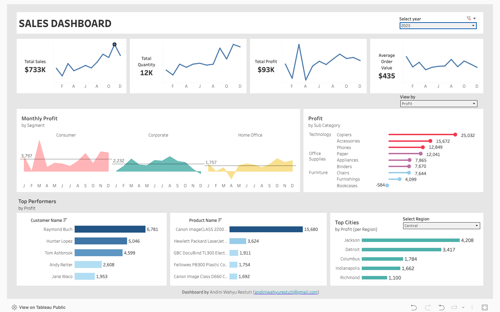

# 📊 Sales Dashboard – Tableau Project

## 🧠 Overview

This project showcases an interactive **Sales Performance Dashboard** built using **Tableau Public**.

---

## 🎯 Objectives

- Monitor **total sales, profit, quantity**, and **average order value (AOV)**
- Analyze **monthly sales trends** segmented by customer segment
- Discover **top-performing customers and products**
- View performance by **category and sub-category**
- Identify **regional and city-level sales performance**

---

## 📈 Key Insights

- 📌 **Sales trends showed a steady increase** throughout the year, especially in the last quarter
- 📌 The **average order value (AOV)** remained relatively stable throughout the year  
- 📌 The **Consumer segment** contributed the most in both **sales** and **profit**, compared to other segments
- 📌 **Phones** had the highest total sales, but **Copiers** generated the most **profit**  
- 📌 The **Canon imageCLASS 2200** was the top-selling product  
- 📌 **New York City** led in city-based sales

---

🔗 **View on Tableau Public**  
[👉 Click to open interactive dashboard](https://public.tableau.com/views/Project2Andin/Dashboard1?:language=en-US&:sid=&:redirect=auth&:display_count=n&:origin=viz_share_link)
